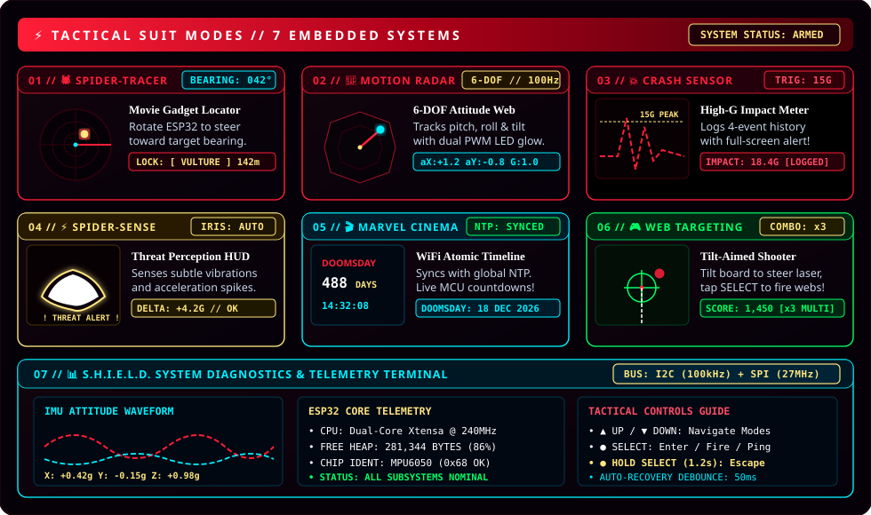
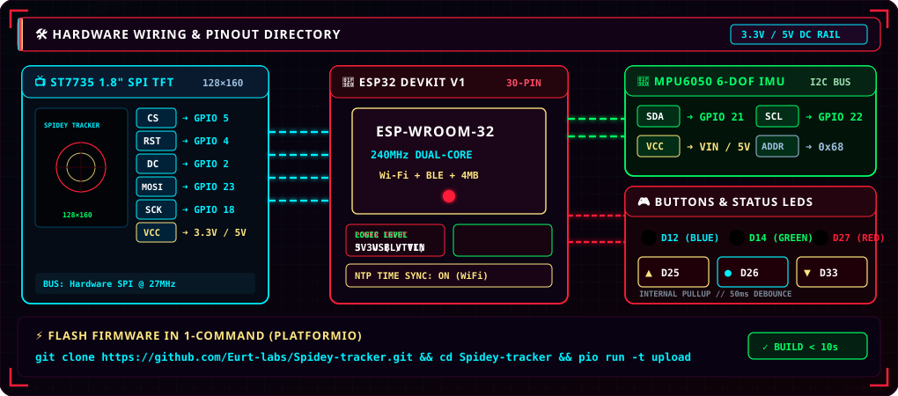

<p align="center">
  
</p>

<p align="center">
  <a href="https://www.espressif.com/en/products/socs/esp32"></a>
  <a href="https://platformio.org/"></a>
  <a href="https://www.arduino.cc/"></a>
  <a href="LICENSE"></a>
</p>

---

<p align="center">
  
</p>

---

<p align="center">
  
</p>

---

## ⚡ 30-Second Quickstart

```bash
# 1. Grab the repository
git clone https://github.com/Eurt-labs/Spidey-tracker.git
cd Spidey-tracker

# 2. Flash to your ESP32 in one command
pio run -t upload

# 3. Optional: Open serial monitor @ 115200 baud
pio device monitor
```

---

## 🕹️ Controls

- **▲ UP / ▼ DOWN** — Scroll modes / Switch targets & movies / Adjust sensitivity
- **● SELECT** — Activate / Fire web tracer / Trigger sonar ping
- **● HOLD SELECT (1.2s)** — Quick escape hatch to return to the main menu from any mode

---

<p align="center">
  <sub>Built with ❤️ &amp; spider-webs by <b><a href="https://github.com/Eurt-labs">@Eurt-labs</a></b>. Licensed under the <a href="LICENSE">MIT License</a>.</sub><br/>
  <sub><i>"With great power comes great response time."</i> 🕷️⚡</sub>
</p>
