<p align="center">
  
</p>

<p align="center">
  
  
  
  
</p>

---

## 🕸️ What is this?

Hey! I built this over the weekend just for fun because I’ve always wanted a real-life handheld **Spider-Tracer** on my desk. 

It runs on an **ESP32**, a little **1.8" TFT screen**, and an **MPU6050 motion sensor**. You turn it on, a movie-style boot animation plays, and you get a mini tactical radar in your hands!

---

## 🕹️ The Fun Stuff (7 Modes)

1. **🕷️ Spider-Tracer (Movie Simulator)** — Rotate the ESP32 in your hand to track down villains (*Vulture, Goblin, Doc Ock, Electro*). When you point toward their bearing, signal strength spikes to 99% and locks on with a target reticle! Press **SELECT** to fire a sonar ping wave.
2. **🎯 Motion Radar** — 6-DOF attitude web radar that tracks your real-time tilt, pitch, and roll with live G-force meters.
3. **💥 Crash Detector** — High-G impact tension meter with a 15G trigger threshold. Drop or shake it and the screen goes into full emergency red strobe alert!
4. **⚡ Spider-Sense** — Animated Spider-Man mask eyes that squint and widen. Detects sudden motion and flashes `! THREAT ALERT !` with LED strobes.
5. **🎬 Marvel Cinema Tracker** — Connects to WiFi to fetch real atomic time and counts down (`DAYS LEFT` + `HH:MM:SS`) to upcoming movies (*Avengers: Doomsday (18 Dec 2026)*, *Secret Wars*, *Spider-Man: Brand New Day*), and shows days elapsed since release for older favorites.
6. **🎮 Web Shooter Mini-Game** — Tilt the board to aim the laser crosshair and tap **SELECT** to shoot web tracers at moving drones!
7. **📊 S.H.I.E.L.D. Stats** — Live gyro/accel telemetry, chip ID, CPU temp, and RAM monitor.

---

## 🛠️ Quick Wiring Cheat-Sheet

| Part | Pin | ESP32 Pin | GPIO |
|:---|:---|:---|:---|
| **ST7735 1.8" TFT** | VCC / GND | 3.3V / GND | — |
| | LED (Backlight) | 3.3V | — |
| | CS / RESET / DC | D5 / D4 / D2 | GPIO 5 / 4 / 2 |
| | SDA (MOSI) / SCK | D23 / D18 | GPIO 23 / 18 |
| **MPU6050 Sensor** | VCC / GND | VIN (5V) / GND | — |
| | SDA / SCL | D21 / D22 | GPIO 21 / 22 |
| **LEDs** | Blue / Green / Red | D12 / D14 / D27 | GPIO 12 / 14 / 27 |
| **Buttons** | UP / SELECT / DOWN | D25 / D26 / D33 | GPIO 25 / 26 / 33 |

---

## 🎮 Controls

- **▲ UP / ▼ DOWN** — Scroll menus / Switch targets & movies / Adjust sensitivity
- **● SELECT** — Select item / Fire web shot / Sonar ping
- **● HOLD SELECT (1.2s)** — Quick exit back to main menu anytime

---

## ⚡ How to Flash It

All you need is [PlatformIO](https://platformio.org/):

```bash
# 1. Clone & enter folder
git clone https://github.com/Eurt-labs/Spidey-tracker.git
cd Spidey-tracker

# 2. Build & flash to ESP32
pio run -t upload

# 3. Optional: Open serial monitor (115200 baud)
pio device monitor
```

---

## 📜 License

MIT License — do whatever you want with it, customize the code, and have fun swinging! 🕷️⚡
